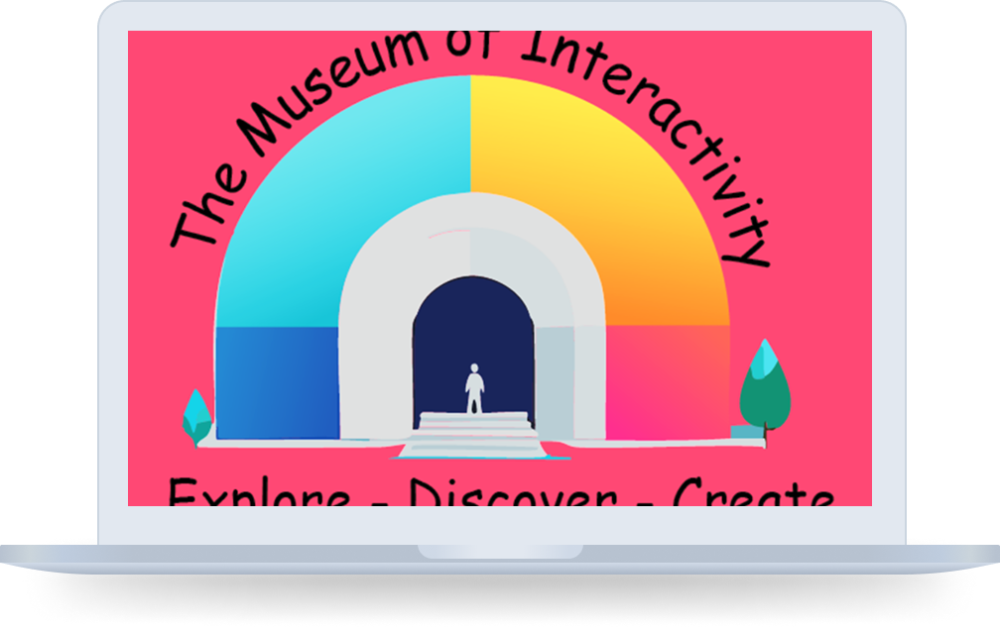

# 🏛️ Museum of Interactivity  
  

A sleek, responsive webpage for an interactive museum, built with **HTML & CSS** to enhance user engagement.  

## 📖 Description  
This project is a visually engaging and interactive museum website, designed to showcase exhibits in an intuitive and appealing way. The main objective was to create an accessible, user-friendly, and visually appealing webpage using only **HTML & CSS**.  

### 🔹 Features  
- Fully responsive layout for all devices  
- Smooth animations and transitions  
- Clean, structured, and accessible design  
- Optimized performance for fast loading  

---

## 🛠️ **Built With**  
- **HTML5**  
- **CSS3**  

---

## 🚀 **Getting Started**  

### 📥 Installing  
To get a local copy up and running, follow these steps:  

1. Clone the repository:  
   ```sh
   git clone https://github.com/yourusername/museum-interactivity.git
   
---

## ▶️ Running the Project
Since this is a static HTML & CSS project, no additional setup is required. Simply open the index.html file in your browser.

---
## 🤝 Contributing
Contributions are welcome! If you’d like to contribute:

1. Fork the repository
2. Create a new branch (git checkout -b feature-branch)
3. Commit your changes (git commit -m 'Add new feature')
4. Push to the branch (git push origin feature-branch)
5. Open a Pull Request

---

## 📬 Contact
Feel free to reach out through:

[LinkedIn](https://linkedin.com/in/bjørn-thomas-torvund-723189a7)
[Twitter](https://twitter.com/thomastorvund")
[Mail](mailto:bjorn.thomas.torvund@gmail.com)

